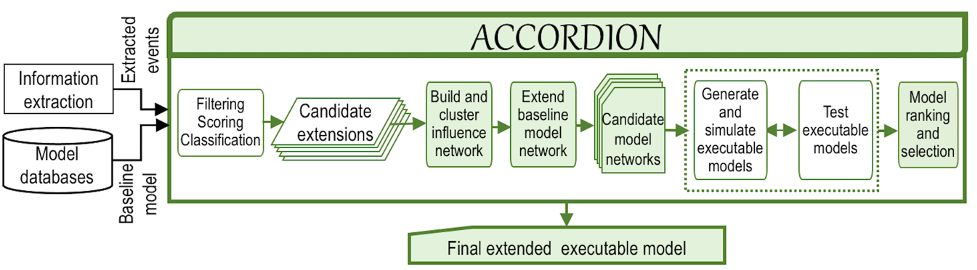
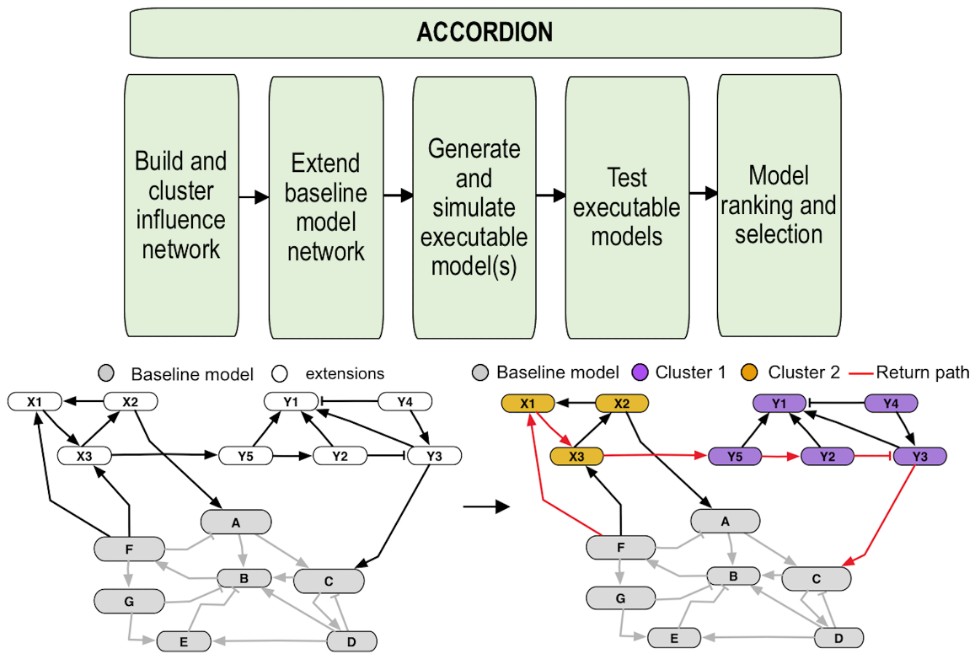

.. ACCORDION documentation master file, created by
   sphinx-quickstart on Fri May 21 08:17:49 2021.
   You can adapt this file completely to your liking, but it should at least
   contain the root `toctree` directive.

Welcome to ACCORDION's documentation!
=====================================

|
.. image:: https://readthedocs.org/projects/accordion/badge/?version=latest
    :target: https://accordion.readthedocs.io/en/latest/?badge=latest
    :alt: Documentation Status
.. image:: https://mybinder.org/badge_logo.svg
    :target: https://mybinder.org/v2/gh/pitt-miskov-zivanov-lab/ACCORDION/HEAD?labpath=%2Fexamples%2Fuse_ACCORDION.ipynb
|

ACCORDION (ACCelerating and Optimizing model RecommenDatIONs) is novel tool and methodology for rapid model assembly by automatically extending dynamic network models with the information published in literature. This facilitates information reuse and data reproducibility and replaces hundreds or thousands of manual experiments, thereby reducing the time needed for the advancement of knowledge.

ACCORDION objectives
--------------------
1.	Extending dynamic network models by combining clustering and path finding with model testing on a set of predefined desired system properties
2.	Evaluating the effect of published literature and machine reading when automatically reconstructing an existing model

ACCORDION architecture
----------------------
Flow diagram of the ACCORDION processing steps and outputs.

ACCORDION conceptual overview
-----------------------------

Applications
------------
The primary application area of ACCORDION is dynamic and causal network models.

.. toctree::
   :maxdepth: 2
   :caption: Contents

   runAccordion
   markovCluster
   TutorialandInstallation
   Legal
